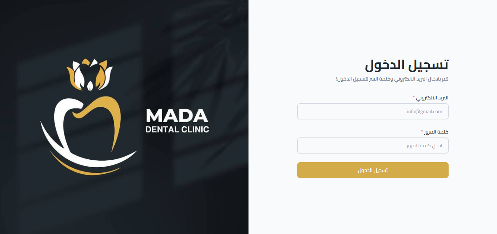
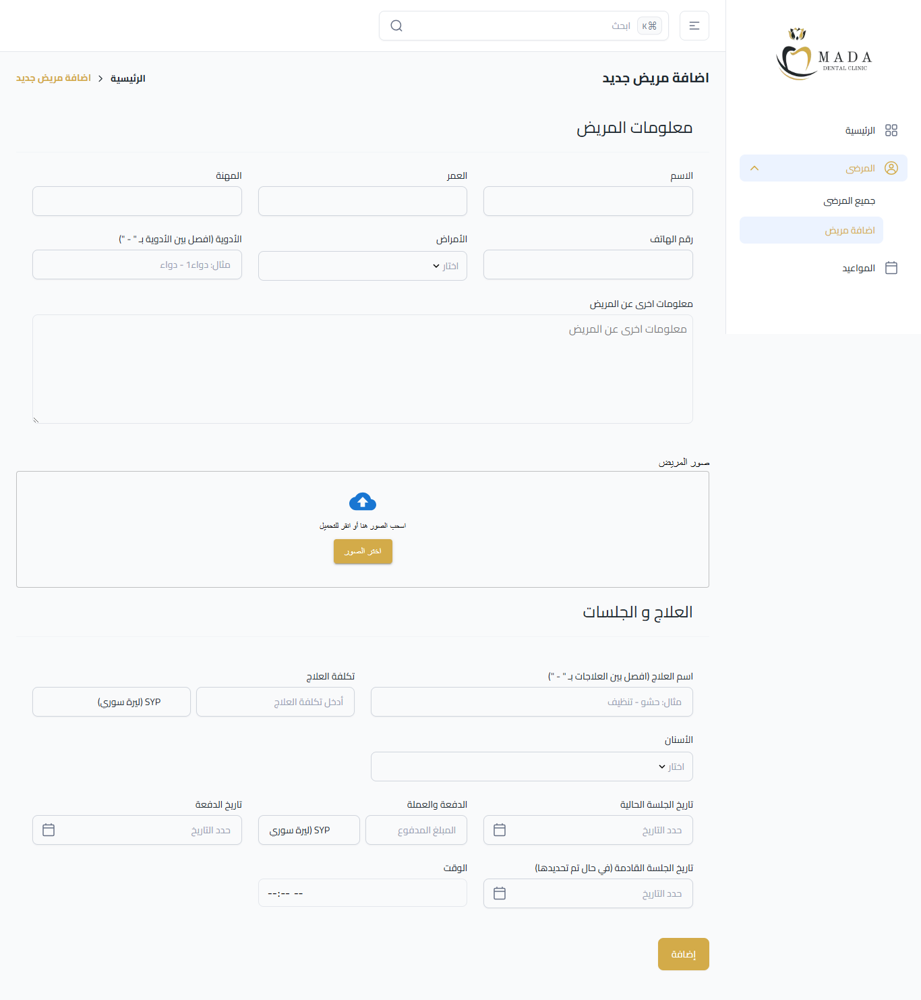

Dental Clinic Management System (DCMS) 
A comprehensive, high-performance platform designed for dental professionals to manage clinical workflows, anatomical mapping, and patient relationships with precision.

🚀 Project Overview & Tech Stack

This system is built to handle complex medical data while maintaining a smooth, responsive user experience. It leverages a modern full-stack architecture to ensure data integrity and real-time updates.

Next.js (App Router): The core framework, utilizing API Routes for backend communication and server-side rendering for SEO and speed.

TypeScript: Provides strict type-safety for complex nested objects (like treatments and tooth mapping).

Tailwind CSS: For a modern, responsive, and medical-grade UI.

Lucide React: For consistent and professional iconography.

Dynamic API Infrastructure: Uses centralized API routes (e.g., /api/patients/[id]) to handle CRUD operations for profiles, images, and clinical data

🩺 Doctor’s Control Panel (Dashboard)

The Doctor's interface is the "Command Center" of the clinic, offering total control over patient care and clinic administration.

1. Advanced Patient Management

Smart Search: Instantly find any patient using an intelligent search bar that filters by Name or the Unique Patient Code.

New & Existing Patients: Doctors can register new patients on the fly or schedule appointments for existing ones.

Full CRUD Control: The ability to edit or completely delete any part of a patient's file (Personal info, Medical history, Treatments, or the entire profile).

2. Anatomical Dental Mapping (The Core)

This feature allows for highly detailed clinical documentation based on the human dental structure:

Quadrant Division: The mouth is divided into four sections (Upper Right, Upper Left, Lower Right, Lower Left), each containing 8 teeth.

Arch-Level Treatment: Doctors can select a full arch (e.g., Upper Right) for general treatments like whitening.

Granular Teeth Detail: Selecting an arch automatically lists all 8 teeth within it, allowing the doctor to add specific, customized treatments and notes for each individual tooth.

Visual History: A visual dental map displays treated teeth, providing an immediate graphical overview of the patient's status.

3. Medical & Financial Tracking
   
Medical History: Real-time management of chronic illnesses and current medications.

Image Gallery: A clinical media manager for X-rays and photos with high-resolution lightbox viewing.

Session-Based Treatments: Each treatment (e.g., Orthodontics) can contain multiple sessions.

Financial Precision: For every session, the doctor records the date, progress, payment amount, and payment date.

👤 Patient Portal & Access
The system provides a dedicated space for patients to engage with their treatment plan and stay informed.

1. Secure Access
Unique Patient Code: When a doctor creates a patient file, the system automatically generates a unique code.

Login: The patient uses this specific code (provided by the doctor) to log in to their private account. There is no need for complex passwords; the code serves as their secure key.

2. What the Patient Sees
Once logged in, the patient has a read-only view of their clinical journey:

Treatment Progress: They can see their active treatments and which teeth are being worked on.

Session History: A log of all past sessions, including notes provided by the doctor.

Financial Transparency: Patients can see their payment history, remaining balances, and the currency used.

Upcoming Appointments: A clear view of the "Next Session Date" scheduled by the doctor to ensure they never miss a visit.

Multi-Currency Support: Doctors can toggle between different currencies for billing to suit their financial environment.

## 📸 لقطات من المشروع (Screenshots)

#### لوحة تحكم الطبيب 

#### إضافة مريض جديد

#### الصفحة الرئيسية للوحة التحكم

#### لوحة التحم - صفحة المريض

#### ملف المريض وتفاصيل العلاج والأسنان

